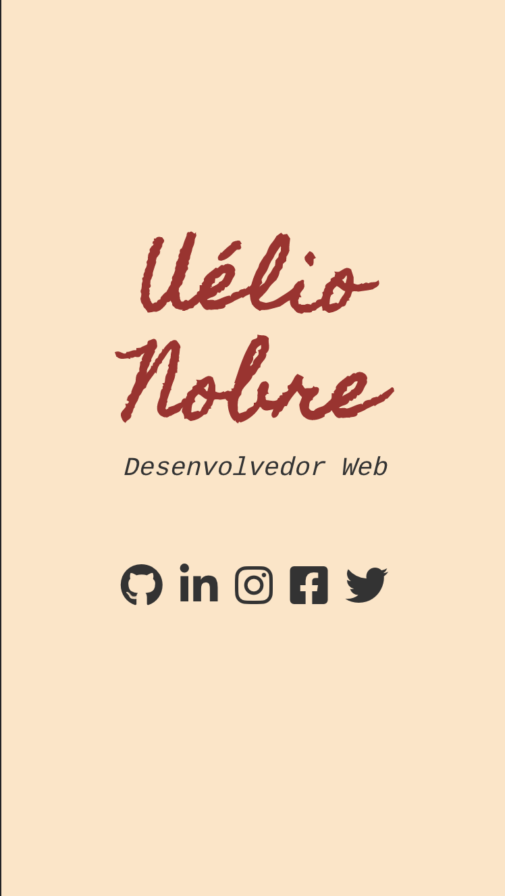

# App Business Card

Este trabalho feito com HTML e CSS. É um trabalho bem minimalista, utilizando algumas fontes de terceiros para compor o visual.

## Recursos utilizados neste trabalho

- _`Fonte externas`_

  As fontes utilizadas neste projeto estão disponíveis no _Google Fonts_.

- _`Font Awesome`_

  É um conjunto de fontes e icones já prontos, disponíveis para melhorar a qualidade visual de uma página.

## Screenshot

O resultado final pode ser visto na captura de tela abaixo:

Enjoy!
