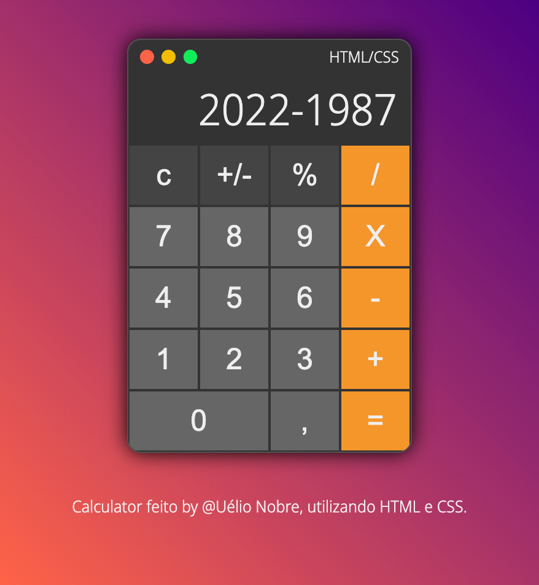
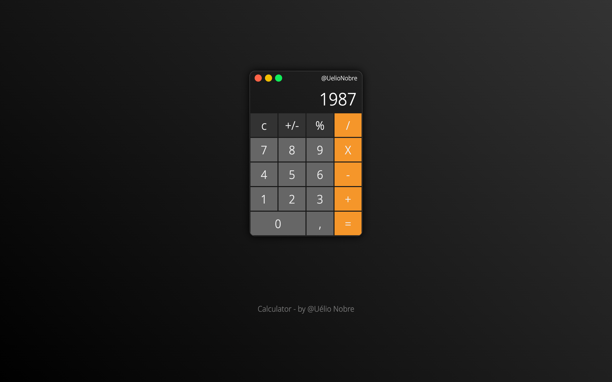

# Calculadora CSS

Calculadora feita com HTML e CSS utilizando flexbox para criar o layout.

## Recursos utilizados neste trabalho

_`Fonte externas`_

A fonte utilizada neste projeto esta disponível no _Google Fonts_.

- Noto Sans Display [GoogleFonts](https://fonts.google.com/noto/specimen/Noto+Sans+Display?query=Noto+Sans+Display)

## Screenshot

O resultado final pode ser visto na captura de tela abaixo:

Ou a versão "dark", rsrsrs:

Até mais...
.o/
